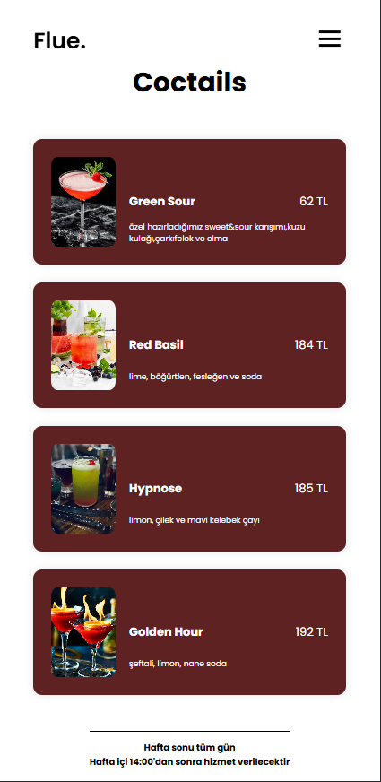

# Kütüphane Otomasyonu

Bu Proje bir QR Code'lu menü projesidir 

## Ekran Görüntüleri

## QR Code Ekranı

## Ana Ekran

## Ana Ekran Mobil Boyut

## Ana Ekran Mobil Boyut 2

## İcerikler

### Gereksinimler

- **Visual Studio CODE**
- **HTML**
- **CSS**
- **JAVASCRIPT**

## Lisans
Bu proje [MIT Lisansı](LICENSE) altında lisanslanmıştır.
